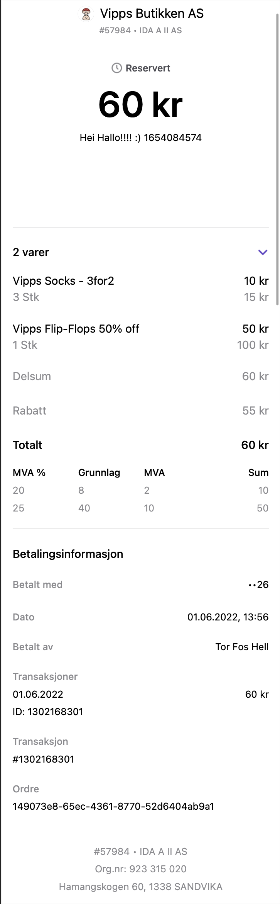

# Vipps Order Management API v2
This repository contains developer resources for the Vipps Order Management API. The Vipps Order Management API allows merchants to enrich Vipps transactions with a [Receipt](#receipts) and a [Category](#category) that contains an image. This information is shown to the customer in the app in their order history and right after in-store purchases.

The purpose of enriching transactions is to give
your customers more convenience, better overview and a more compelling shopping
experience when they use Vipps to pay for your products and services.
Vipps Order management also enables you to draw customers back to your website
or app from links on the Vipps receipt view.
This functionality is available for
[recurring](https://github.com/vippsas/vipps-recurring-api)
and
[direct payments](https://github.com/vippsas/vipps-ecom-api),
but not for
[passthrough payments](https://github.com/vippsas/vipps-psp-api).

Detailed documentation on how to use the Order Management Api can be found here:
* [API Guide](vipps-order-management-api.md)

You can peruse the API reference documentation as:
* [Swagger UI](https://vippsas.github.io/vipps-order-management-api/)
* [ReDoc](https://vippsas.github.io/vipps-order-management-api/redoc.html)

# Receipts
The `receipt` concept will allow the merchant to add orderlines to a Vipps Transaction. This can be used as proof of purchase when returning goods, as an electronic copy for expensing or in scenarios where a paper printer is not available. We also know our customers love this information.
* [Receipts API Guide](vipps-order-management-api.md#receipts)

  

# Categories and Images
The `category` concept may be added to a Vipps Transaction to give extra information and can be used as a way to draw customers back to the merchants web page. In addition to the category, it is possible to add a image to the Vipps transaction.
* [Categories API Guide](vipps-order-management-api.md#categories)

  

## Questions?

We're always happy to help with code or other questions you might have!
Please create an [issue](https://github.com/vippsas/vipps-ecom-api/issues),
a [pull request](https://github.com/vippsas/vipps-ecom-api/pulls),
or [contact us](https://github.com/vippsas/vipps-developers/blob/master/contact.md).

Sign up for our [Technical newsletter for developers](https://github.com/vippsas/vipps-developers/tree/master/newsletters).
