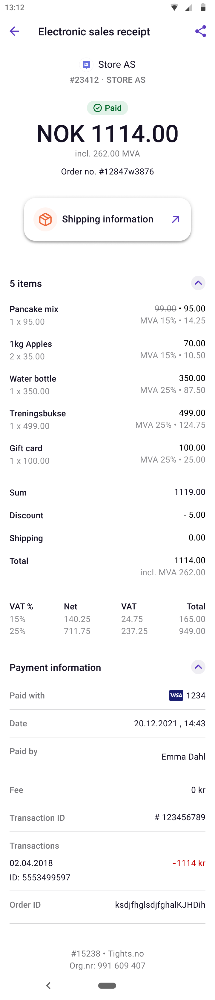

# Vipps Order Management API v1

💥 DRAFT! This is unfinished work and subject to change. 💥

The Vipps Order Management API allows merchants to send rich receipt information to existing Vipps transactions. This information is shown to the customer in the app in their order history.

This functionality is available for both
[direct payments](https://github.com/vippsas/vipps-ecom-api)
and
[recurring payments](https://github.com/vippsas/vipps-recurring-api),
but not for
[passthrough payments](https://github.com/vippsas/vipps-psp-api).

With this API merchants are able to send images, receipts (order lines) and other information.
Images are handled detached from transactions.
This means that the merchant could upload one image and reuse it for several orders.
Images must be added before the metadata for a transaction.

## Introduction

The Vipps Order Management API enables you to communicate with your customers through the payment receipts in the Vipps app. The purpose of doing this is to give your customers more convenience, better overview and a more compelling shopping experience when they use Vipps to pay for your products and services. The Vipps Order Management API also enables you to draw customers back to your website or app from links on the Vipps receipt view.

## Vipps Order Management capabilities

The Vipps Order Management API currently has the following capabilities:

* Links
* Images of orders (TBA)
* Proof of purchase / Valid receipt

We plan to add even more capabilities in the future.

Images are handled detached from transactions. This means that the merchant could upload one image and reuse it for several orders. Images must be added before the metadata for a transaction.

### Links

In order to provide customers with more up to date information about their order, you can add a URL / link to the payment receipt in Vipps that can take the customer to a location on your website. Links are activated when a customer clicks the link area on the Vipps receipt. The mobile device's standard web browser will open and the user is redirected to the link location.

Below you can se an example of a Vipps receipt containing a link to "Shipping information".


Links have a type or category that will affect infographics and how it is handled in the Vipps app. We currently support these cathegories:

- **Receipt**: A link to a location where the customer can access and download a valid proof of purchase and receipt for this particular order
- **Order Confirmation**: A link to a location that contains information and status of the order. If your webshop or site has a "My orders" page or similar - this link cathegory can take the customer there.
- **Delivery information**: A link to a location that contains information and status about the shipping or delivery related to the order. This could be a link to hosted by your freight carrier, or a link to your site. If your webshop or site has a "My order" page that includes delivery related information about the order - this link cathegory can be used.
- **Ticket**: A link to a location where the customer can access and download a ticket to an event, trip or transportation.
- **Booking**: A link to a location that contains information and status about a booking, such as travel and rental booking. If your webshop or site has a "My bookings" page or similar, this link cathegory can take the customer there.
- **General**: If none of the other cathegories fit the use case for the link, a *General* category can be used. This is a link to a location that contains any kind of information pertinent to the order. We encourage you to use the more specific cathegories if possible.


### Images of order (TBA)

With Vipps Order Management API you can upload an image that represents the order. This could be a specific image showing the product in this order, a collection of images that will be shown as a collage in Vipps. Below you can see an example of a Vipps receipt containing an image of the shopping card (single product)


### Order Lines and Proof of Purchase
In addition to providing a user with a link to a valid receipt hosted on your site, it is also possible have the receipt hosted inside the Vipps app. To enable this you can send necessary information such as order lines and VAT rates to the Order Management API and Vipps will generate a receipt that can be used for proof of purchase and expensing.

In addition to providing the user with a valid receipt inside Vipps, order lines will also give the user a much better overview of the purchase. Furthermore, in the case of partial order fulfullments or returns the order lines may be updated to reflect what the user actually ended up paying for using Vipps.



# Getting Started

## Before you begin
This section covers the quick steps for getting started with the Order Management API to enrich orders with metadata. This document assumes you have signed up as a organisation with Vipps and have your test credentials from the Merchant Portal.

It also assumes that a payment has been initialized and reserved and that you have the transaction id.

## 1. Authentication
```bash
curl https://apitest.vipps.no/accessToken/get \
-H "client_id: YOUR-CLIENT-ID" \
-H "client_secret: YOUR-CLIENT-SECRET" \
-H "Ocp-Apim-Subscription-Key: YOUR-SUBSCRIPTION-KEY" \
-X POST
```

In response you will get a body with the following schema.
The property `access_token` should be used for all other API requests in the `Authorization` header as the Bearer token.

```json
{
  "token_type": "Bearer",

  "expires_in": "3599",

  "ext_expires_in": "3599",

  "expires_on": "1614116654",

  "not_before": "1614112754",

  "resource": "00000002-0000-0000-c000-000000000000",

  "access_token": "eyJ0eXAiOiJKV1QiLCJhbGciOiJSUzI1NiIsIng1dCI6Im5PbzNaRHJPRFhFSzFqS1doWHNsSFJfS1hFZyIsImtpZCI6Im5PbzNaRHJPRFhFSzFqS1doWHNsSFJfS1hFZyJ9.eyJhdWQiOiIwMDAwMDAwMi0wMDAwLTAwMDAtYzAwMC0wMDAwMDAwMDAwMDAiLCJpc3MiOiJodHRwczovL3N0cy53aW5kb3dzLm5ldC9lNTExNjUyNi01MWRjLTRjMTQtYjA4Ni1hNWNiNDcxNmJjNGIvIiwiaWF0IjoxNjE0MTEyNzU0LCJuYmYiOjE2MTQxMTI3NTQsImV4cCI6MTYxNDExNjY1NCwiYWlvIjoiRTJaZ1lMQmF1V25qcG12c2NhYlhJOTliSmt3c0FRQT0iLCJhcHBpZCI6IjIyNWVmMTU5LWFjZjAtNGRiNy04OGU0LWNlNDMyODYxOWM3MyIsImFwcGlkYWNyIjoiMSIsImlkcCI6Imh0dHBzOi8vc3RzLndpbmRvd3MubmV0L2U1MTE2NTI2LTUxZGMtNGMxNC1iMDg2LWE1Y2I0NzE2YmM0Yi8iLCJyaCI6IjAuQVNBQUptVVI1ZHhSRkV5d2hxWExSeGE4UzFueFhpTHdyTGROaU9UT1F5aGhuSE1nQUFBLiIsInRlbmFudF9yZWdpb25fc2NvcGUiOiJFVSIsInRpZCI6ImU1MTE2NTI2LTUxZGMtNGMxNC1iMDg2LWE1Y2I0NzE2YmM0YiIsInV0aSI6Imo4bHRFZER5R2tDeURtdXR3QVVNQUEiLCJ2ZXIiOiIxLjAifQ.IeLADJiz5WRdQgf-3LfnUCfiQpKNjRIJjvDfYzoG9xgOQwBhSKeDlelIx0_FMx3oHtvYkGWebDy0Y1HjdrbgzoA2RTeIzS8IjylZcGfSuhA6kUvBa4JUPLW4Irefp3Bv77gUfS0dVzHVILADV-8VSCjivld7ovEANQagupsi4zhAyVWuNuHurDOSSI33lxnes-FmphUfiUfwmye9B676lwaj28I1dP3JxqFDDf3SNkjNLvTZyiDaIprZrt4TC_t5eopzqCL4X1ymnWxzJzMMPQGVOvhNEJj1oI_5VbRtoYdo_b5bYsU5ZS7JSGcuOpog7vEtVk6uJDDT0MfQIuOLaeA"
  }
}
```


# API summary

- `/order-management/v1/image`
	- Endpoint for uploading pictures of products as a b64-string, along with an ID defined by the merchant. An image exists independently of any transaction. It is not possible to overwrite an image.
- `/order-management/v1/receipt/{vippsTransactionId}`
	- Endpoint for sending receipt information (an array of order lines). Order lines are descriptions of each item present in an order. A receipt is immutable and, once sent, cannot be overwritten.
- `/order-management/v1/order/{vippsTransactionId}`
	- Endpoint for sending all other information about a transaction, including ID references to images previously uploaded. This object is mutable, and a new request will completely overwrite previous requests.


## API endpoints
# Orders
| Operation | Description | Endpoint |
| --------- | ----------- | -------- |
| [Update order](#update-order)| Update order with enriched data | `PUT:/order-management/v1/order/{transactionId}` |
| [Get order](#get-order) | Fetch the existing data for an order | `GET:/order-management/v1/order/{transactionId}`   |

|Parameter | Type | Required | Description|
|----------|------|----------|------------|
| `category` | `string` | Y | general, receipt, orderConfirmation, delivery, ticket or booking|
| `orderDetailsUrl` | `string` | Y | Must be secure, absolute and valid url or app-native url |
| `image` | `imageId` | N |   |
| `imageId.id` | `string` | Y | Only A-Z, a-z, 0-9, '-', '_', '.' are valid characters |


## Update order
	PUT:/order-management/v1/order/{transactionId}
Example request body
```
{
  "category": "general",
  "orderDetailsUrl": "https://mystore.no/order/987654",
  "image":
    {
      "id": "img1234",
    }
}
Or  
{
  "category": "ticket",
  "orderDetailsUrl": "ruter:///min/bilett",
  "image":
    {
      "id": "ruter_bilett",
    }
}
```
## Get order
	GET:/order-management/v1/order/{transactionId}
Example response
```
{
  "category": "general",
  "orderDetailsUrl": "https://mystore.no/order/987654",
  "image":
    {
      "id": "img1234",
    }
}
```


# Images (TBA)
| Operation | Description | Endpoint |
| --------- | ----------- | -------- |
| [Upload image](#upload-image) | Upload an image| `POST:/order-management/v1/image` |

The api experimentally supports image uploading. An image is uploaded in base64 format to the image endpoint and can then be used on any number of orders.

For now supported image formats are jpg and png.

|Parameter | Type | Required | Description|
|----------|------|----------|------------|
| `imageId` | `string` | Y | Unique identifier of image|
| `src` | `string` | Y | base64 encoded image|
| `type` | `string` | Y | Type of image. Only base64 is supported right now.|

Example request of uploading one image

## Upload image
	PUT:/order-management/v1/image
Example request body
```
{
  "imageId": "image1234",
  "src": "dGhpcyBpcyBhbiBpbWFnZQ==",
  "type": "base64"
}
```
Remarks  
imageId: Only A-Z, a-z, 0-9, '-', '_', '.' are valid characters


# Receipts
| Operation | Description | Endpoint |
| --------- | ----------- | -------- |
| [Upload receipt](#upload-receipt) | Upload a receipt  | `POST:/order-management/v1/receipt/{transactionId}` |
| [Get receipt](#get-receipt) | Get an uploaded receipt | `GET:/order-management/v1/receipt/{transactionId}` |


The api supports receipt uploading.
### Receipt
|Parameter | Type | Required | Description|
----------|------|----------|------------
|[`orderLines`](#orderLine) | `array of OrderLine` | Y | Minimum one element |
|`shippingAmount` | `integer` | N | Currency without delimiter eg NOK 100.00 is 10000 |

### OrderLine
|Parameter | Type | Required | Description|
----------|------|----------|------------
|`amountExcludingTax` | `integer` | Y | Currency without delimiter eg NOK 10.25 is 1025 |
|`amountIncludingTax` | `integer` | Y | Currency without delimiter eg NOK 10.25 is 1025 |
|`description` | `string` | Y | Item description |
|`id` | `string` | Y | Item identifier |
|`productUrl` | `string` | N | Valid secure url or app native url |
|`quantity` | `integer` | Y | Number of purchased items |
|`taxAmount` | `integer` | Y | Currency without delimiter eg NOK 10.25 is 1025 |
|`taxPercentage` | `integer` | Y | Number without delimiter eg 15% is 1500 |
|`discount` | `integer` | Y | Currency without delimiter eg NOK 10.25 is 1025 |


## Upload receipt
	PUT:/order-management/v1/receipt/{transactionId}

Example request body
```
{
  "orderLines": [
    {
      "amountExcludingTax": 10000,
      "amountIncludingTax": 12000,
      "description": "cotton t-shirt (blue, medium)",
      "id": "998877",
      "productUrl": "https://mystore.no/products/998877",
      "quantity": 1,
      "taxAmount": 2000,
      "taxPercentage": 2000,
      "discount": 0
    }
  ],
  "shippingAmount": 15000
}
```

## Get receipt

GET:/order-management/v1/receipt/{transactionId}

Example response body
```
{
  "orderLines": [
    {
      "amountExcludingTax": 10000,
      "amountIncludingTax": 12000,
      "description": "cotton t-shirt (blue, medium)",
      "id": "998877",
      "productUrl": "https://mystore.no/products/998877",
      "quantity": 1,
      "taxAmount": 2000,
      "taxPercentage": 2000,
      "discount": 0
    }
  ],
  "shippingAmount": 15000
}
```
